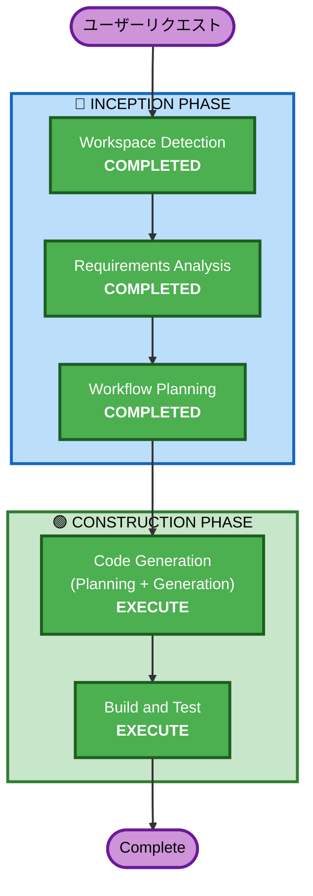

# Execution Plan — ログイン時自動起動ON/OFF設定

## 詳細分析サマリー

### 変更影響評価
- **ユーザー向け変更**: Yes — 新しい設定セクションUI追加
- **構造変更**: No — 既存アーキテクチャ内での追加
- **データモデル変更**: No
- **API変更**: No
- **NFR影響**: No

### リスク評価
- **リスクレベル**: Low
- **ロールバック複雑度**: Easy（コード削除で元に戻せる）
- **テスト複雑度**: Simple

## ワークフロー可視化



### テキスト代替
```
Phase 1: INCEPTION
- Workspace Detection (COMPLETED)
- Requirements Analysis (COMPLETED)
- Workflow Planning (COMPLETED)

Phase 2: CONSTRUCTION
- Code Generation (EXECUTE)
- Build and Test (EXECUTE)
```

## 実行するフェーズ

### 🔵 INCEPTION PHASE
- [x] Workspace Detection (COMPLETED)
- [x] Requirements Analysis (COMPLETED)
- [x] User Stories (SKIPPED)
  - **理由**: シンプルな設定追加。ユーザーペルソナ分析不要
- [x] Workflow Planning (COMPLETED)
- [x] Application Design (SKIPPED)
  - **理由**: 既存コンポーネント境界内の変更。新サービス不要
- [x] Units Generation (SKIPPED)
  - **理由**: 単一ユニットで完結する変更

### 🟢 CONSTRUCTION PHASE
- [x] Functional Design (SKIPPED)
  - **理由**: シンプルなロジック。複雑なビジネスルールなし
- [x] NFR Requirements (SKIPPED)
  - **理由**: NFR要件なし。既存のパフォーマンス/セキュリティ設定で十分
- [x] NFR Design (SKIPPED)
  - **理由**: NFR Requirementsをスキップしたため
- [x] Infrastructure Design (SKIPPED)
  - **理由**: インフラ変更なし
- [ ] Code Generation - **EXECUTE**
  - **理由**: 実装コード生成が必要
- [ ] Build and Test - **EXECUTE**
  - **理由**: ビルド確認とテストが必要

## 成功基準
- **主目標**: ログイン時自動起動のON/OFF設定が動作すること
- **主要成果物**:
  - LaunchAtLoginService（ServiceManagement連携）
  - SettingsView（設定画面）
  - SettingsService拡張（設定永続化）
  - PopoverContentViewから設定画面への導線
- **品質ゲート**: `swift build` 成功
